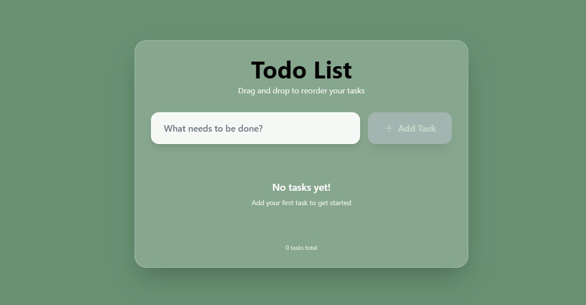

# Interactive Todo List - React with Drag & Drop

A fully interactive Todo List web application built with React, TypeScript, and Tailwind CSS featuring drag-and-drop functionality for task reordering.

##  Features

-  **Add Tasks**: Create new tasks with input validation
-  **Delete Tasks**: Remove tasks with a single click
-  **Toggle Completion**: Mark tasks as completed with checkboxes
-  **Drag & Drop Reordering**: Reorder tasks by dragging and dropping
-  **Persistent Storage**: Tasks are saved to localStorage
-  **Responsive Design**: Works seamlessly on desktop and mobile
-  **Modern UI**: Clean, professional design with smooth animations

##  Tech Stack

- **Frontend**: React 18 with TypeScript
- **Styling**: Tailwind CSS
- **Drag & Drop**: @dnd-kit library
- **Build Tool**: Vite
- **State Management**: React hooks (useState, useEffect)

4. **Preview Production Build**:
   ```bash
   npm run preview
   ```

##  Usage

1. **Adding Tasks**: Type your task in the input field and click "Add Task" or press Enter
2. **Completing Tasks**: Click the checkbox next to any task to mark it as completed
3. **Reordering Tasks**: Click and drag the grip handle (⋮⋮) to reorder tasks
4. **Deleting Tasks**: Hover over a task and click the delete button 

## Project Structure


src/
├── components/
│   ├── TodoItem.tsx      # Individual todo item with drag functionality
│   └── AddTodoForm.tsx   # Form for adding new todos
├── types.ts              # TypeScript type definitions
├── App.tsx               # Main application component
├── main.tsx              # React entry point
└── index.css             # Global styles and Tailwind imports
## Screenshot

