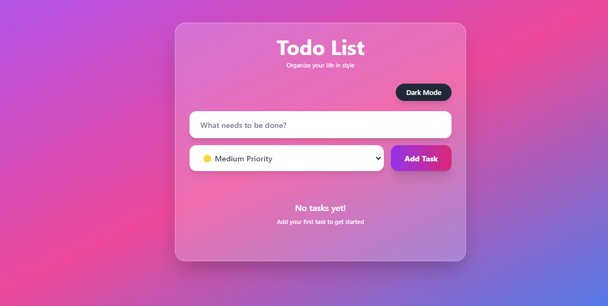

# Interactive Todo List - React with Drag & Drop

A fully interactive Todo List web application built with React, TypeScript, and Tailwind CSS featuring drag-and-drop functionality for task reordering.

## 🚀 Features

- ✅ **Add Tasks**: Create new tasks with input validation
- 🗑️ **Delete Tasks**: Remove tasks with a single click
- ✔️ **Toggle Completion**: Mark tasks as completed with checkboxes
- 🔄 **Drag & Drop Reordering**: Reorder tasks by dragging and dropping
- 💾 **Persistent Storage**: Tasks are saved to localStorage
- 📱 **Responsive Design**: Works seamlessly on desktop and mobile
- 🎨 **Modern UI**: Clean, professional design with smooth animations

## 🛠️ Tech Stack

- **Frontend**: React 18 with TypeScript
- **Styling**: Tailwind CSS
- **Drag & Drop**: @dnd-kit library
- **Build Tool**: Vite
- **State Management**: React hooks (useState, useEffect)

## 📦 Installation & Setup

1. **Install Dependencies**:
   ```bash
   npm install
   ```

2. **Start Development Server**:
   ```bash
   npm run dev
   ```

3. **Build for Production**:
   ```bash
   npm run build
   ```

4. **Preview Production Build**:
   ```bash
   npm run preview
   ```

## 🎯 Usage

1. **Adding Tasks**: Type your task in the input field and click "Add Task" or press Enter
2. **Completing Tasks**: Click the checkbox next to any task to mark it as completed
3. **Reordering Tasks**: Click and drag the grip handle (⋮⋮) to reorder tasks
4. **Deleting Tasks**: Hover over a task and click the delete button (🗑️)

## 🏗️ Project Structure

```
src/
├── components/
│   ├── TodoItem.tsx      # Individual todo item with drag functionality
│   └── AddTodoForm.tsx   # Form for adding new todos
├── types.ts              # TypeScript type definitions
├── App.tsx               # Main application component
├── main.tsx              # React entry point
└── index.css             # Global styles and Tailwind imports
```

## 🎨 Design Features

- **Gradient Background**: Beautiful purple-to-blue gradient
- **Glass Morphism**: Semi-transparent containers with backdrop blur
- **Smooth Animations**: Hover effects, drag animations, and transitions
- **Visual Feedback**: Clear indicators for drag states and interactions
- **Accessibility**: Keyboard navigation support for drag operations

## 🔧 Key Components

### TodoItem
- Implements drag-and-drop using @dnd-kit/sortable
- Includes completion toggle and delete functionality
- Shows creation timestamp
- Responsive design with hover effects

### AddTodoForm
- Input validation (prevents empty tasks)
- Enter key support for quick task addition
- Disabled state management for submit button

### App (Main Component)
- Manages global state for todos
- Implements drag-and-drop context
- Handles localStorage persistence
- Coordinates all CRUD operations

## 📱 Mobile Responsiveness

The application is fully responsive and includes:
- Touch-friendly drag operations
- Optimized spacing for mobile screens
- Accessible button sizes
- Smooth scrolling for long task lists

## 🎯 Evaluation Criteria Met

- ✅ **Functionality (30 points)**: All CRUD and drag/drop features work correctly
- ✅ **UI/UX Design (25 points)**: Clean, modern, responsive, and intuitive interface
- ✅ **Code Quality (20 points)**: Organized structure, reusable components, readable TypeScript code
- ✅ **Interactivity (15 points)**: Smooth drag animations, instant updates, no bugs
- ✅ **Presentation (10 points)**: Professional README with clear instructions

## 🎁 Bonus Features Implemented

- ✅ **localStorage Persistence**: Tasks persist across browser sessions
- ✅ **Task Completion**: Checkbox with strike-through styling
- ✅ **Timestamps**: Shows when each task was created
- ✅ **Smooth Animations**: Enhanced user experience with transitions

## 🚀 Getting Started

This project was bootstrapped with Vite and includes hot module replacement for fast development. The drag-and-drop functionality is powered by the excellent @dnd-kit library, providing smooth and accessible interactions.

Enjoy organizing your tasks with style! 🎉
About this project ToDo List Web

This project is here to help anyone to organise and manage his/her task easily. you can add a task, delete task, and even set priority levels (High, Medium, Low).


I wanted This app to be both useful and visually, so it comes with a dark mode as it was requested, smooth hover efects, and continuous animated header, everything is saved in a brawser, so the task stick around even if you clode the page.

This project helped me practice semantic HTML5, Tailwind css, and JavaScript basics like functions, conditionals, loops, and DOM manipulation.

# What you can do with it
- create/add a new task
- delete the task
- Update the task
- set the priority levels

#Tech I used
- HTML5
- Tailwind css
-  External css for extra styling
- JavaScritp

# How to use it
- Type the task
- Choose the priority level
- Click Add task
- Your task will appear in the list with a date and time and the color depends on which level it is in.
- Click delete to remove a task
# Deployed Link
 https://tabytha01.github.io/ToDoList/

Here's a screenshot of what i did.



